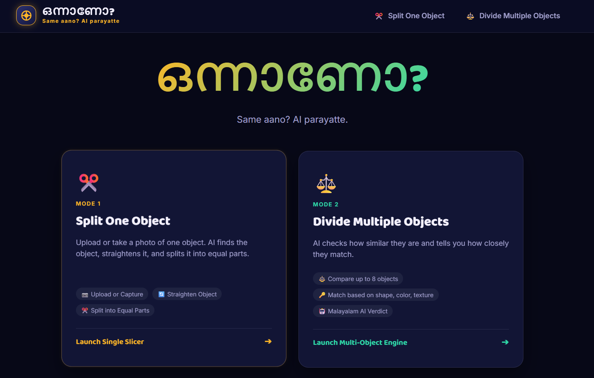
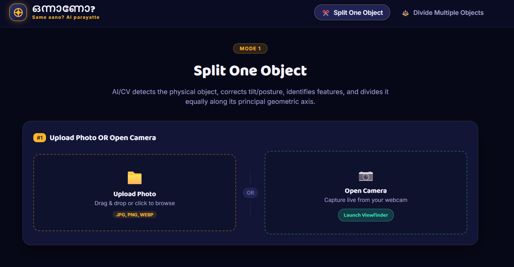
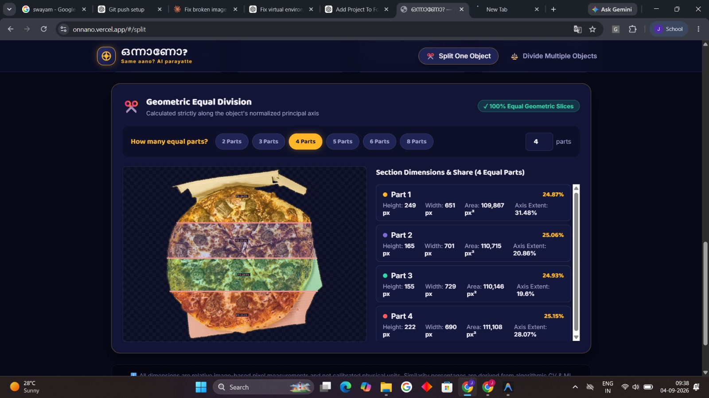
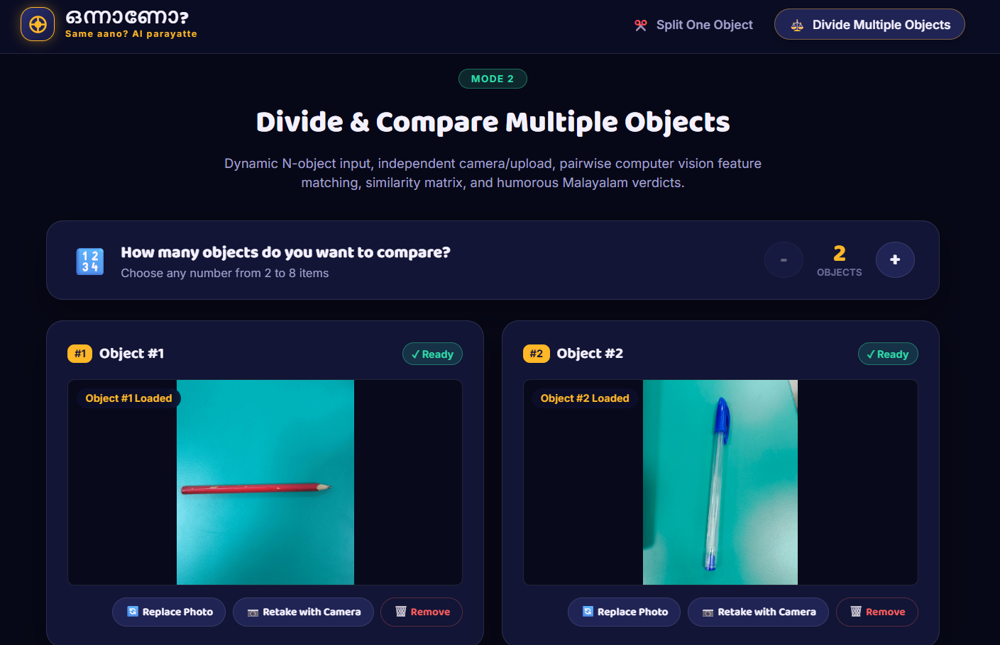
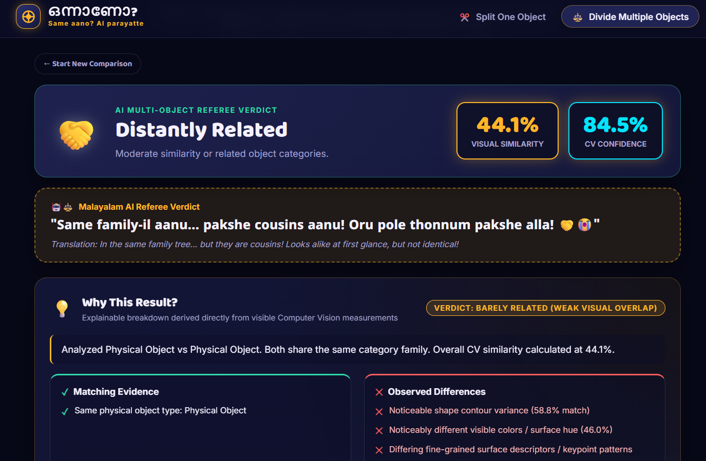
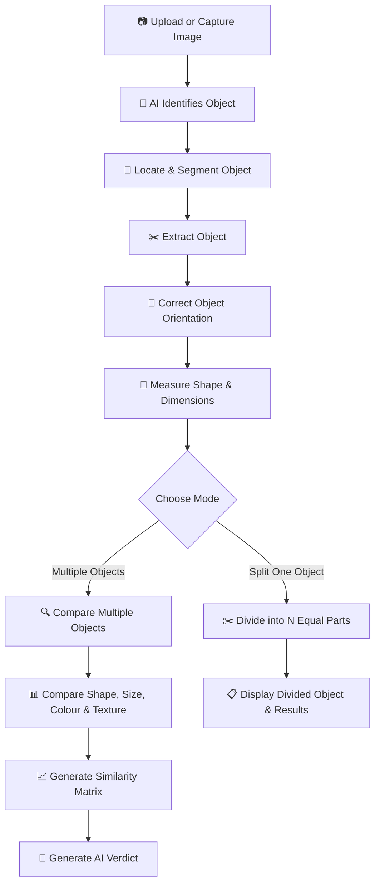
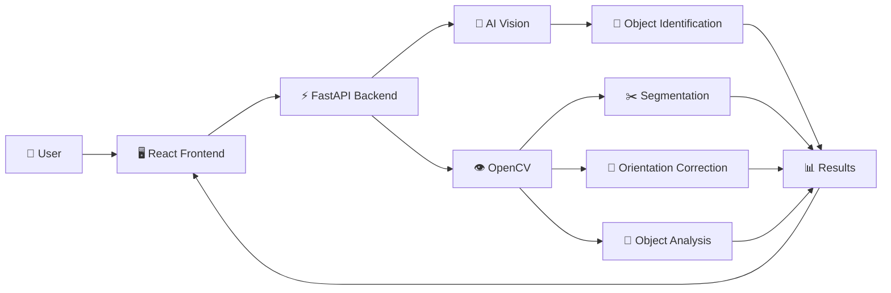

# ഒന്നാണോ? (ONNANO?) 🎯
### *AI & Computer Vision Object Understanding, Posture Normalization & Comparison Engine*

> **“Same aano? AI parayatte.”** — An AI-powered Computer Vision engine that detects, normalizes, identifies, measures physical visual properties, and fairly divides or compares everyday objects.

---

## 👥 Basic Details

### Team Name
**Team MJ**

### Team Members
- **Manya K S** — Frontend & UI/UX Design (MITS)
- **Jiya Joe Palathinkal** — Backend, AI & Computer Vision Pipeline (MITS)

---

## 🚀 The Core Project Idea & Dual Modes

**ONNAANO?** provides two completely distinct computer vision workflows:

### ✂️ Mode 1: Split One Object
1. **Dual Input Methods**: Choose between **Upload Photo** (drag-and-drop, image preview, replace, remove) OR **Open Camera** (live browser webcam stream, viewfinder, instant shutter capture, retake).
2. **AI Posture & Orientation Normalization**:
   - Isolates the foreground object from background noise.
   - Uses Principal Component Analysis (PCA) & bounding geometry to estimate the exact tilt angle.
   - Normalizes and rotates the object to canonical upright alignment with a **Before $\rightarrow$ After** visual comparison.
3. **Object Identification**:
   - Evaluates geometric & visual archetypes (*Pencil*, *Bottle*, *Spoon*, *Ruler*, *Smartphone*, *Cup*, *Book*, *Scissors*, etc.) and reports confidence scores.
4. **Physical Property Extraction**:
   - **Shape**: Circularity ($4\pi A/P^2$), aspect ratio, solidity, rectangularity, bilateral symmetry score.
   - **Dimensions**: Pixel height, pixel width, bounding box, relative area (clearly labeled as `px (Relative / Image-based)` without fake physical units).
   - **Color**: Dominant color name, hex swatch, and top-5 palette distribution bar via K-Means.
   - **Texture**: Surface roughness score, Laplacian variance, gradient magnitude, Shannon entropy.
5. **$N$-Way Geometric Equal Division**:
   - Slices the object strictly along its normalized principal axis into $N$ equal geometric parts (user-selectable 2, 3, 4, 5, 6, 8, etc.).
   - Visualizes colored part segments, cut lines, and section dimensions.

---

### ⚖️ Mode 2: Divide & Compare Multiple Objects
1. **Dynamic Object Count Selector**:
   - Compare 2, 3, 4, ... up to 8 objects dynamically.
   - Renders independent cards for each object, each supporting Upload or Camera independently.
2. **Auto-Enabled Workflow**:
   - As soon as all $N$ photos are ready, the *"⚡ Compare Objects Now"* button automatically enables (zero confirmation popups).
3. **Pairwise Computer Vision Feature Matching (No Fake Percentages)**:
   - **Shape Similarity**: Hu moments (`cv2.matchShapes`), circularity, and aspect ratio.
   - **Dimension Similarity**: Proportions and bounding aspect ratios.
   - **Color Similarity**: 2D HSV histogram correlation (`cv2.compareHist`) and Euclidean dominant color distance.
   - **Texture Similarity**: Surface roughness, gradient variance, and Shannon entropy.
   - **Feature Similarity**: Real ORB / AKAZE keypoints with Lowe's ratio test ($0.78$) and geometric inliers.
   - **Edge Similarity**: Canny edge map density and contour structure.
   - **Weighted Overall Score**: Explainable combination configured in backend (`config.py`).
4. **Multi-Object Dashboard**:
   - **Object Cards**: Raw tilt thumbnail vs AI upright normalized view, detected class, confidence %, dominant color.
   - **Comparison Table**: Comprehensive feature-by-feature side-by-side data table across all objects.
   - **$N \times N$ Similarity Matrix**: Interactive heatmap grid with color-coded percentages.
   - **Pairwise Feature Breakdown**: Animated progress bars for Shape, Dimensions, Color, Texture, Features, Edges, and Overall.
   - **Relationship Classification**:
     - 👯 **Twin-like** (Very high visual similarity & same category)
     - 👨‍👩‍👧 **Related** (High similarity / same category with subtle differences)
     - 🤝 **Distantly Related** (Moderate similarity or related categories)
     - 👀 **Barely Related** (Low similarity but some shared visual traits)
     - 💀 **Strangers** (Very low similarity / unrelated objects)
   - **Malayalam AI Verdict**: Humorous, culturally authentic Malayalam punchlines with English translations.

---

## 🛠️ Technology Stack

### Backend
- **Framework**: FastAPI (Python 3.11)
- **Computer Vision & Math**: OpenCV (`cv2`), NumPy, SciPy, Scikit-learn, Pillow
- **Server**: Uvicorn ASGI Server

### Frontend
- **Framework**: React 18 + Vite
- **Routing**: React Router DOM (v6)
- **Styling**: Modern Glassmorphism CSS design system with customized color tokens (Ink Navy, Mango Gold, Fair Mint, Referee Coral, Electric Indigo)

---

## 📡 API Endpoints

| Method | Endpoint | Description |
|---|---|---|
| `GET` | `/health` | Server health check and active CV pipeline status |
| `POST` | `/api/analyze-object` | Single image upload $\rightarrow$ Isolation, posture correction, identification, property extraction, initial equal slicing |
| `POST` | `/api/divide-object` | Re-slices object along principal axis into custom $N$ parts |
| `POST` | `/api/compare-objects` | Dynamic multi-image upload $\rightarrow$ Runs CV pipeline on each object, pairwise comparisons, $N \times N$ matrix, comparison table, relationship classification & Malayalam verdict |

---

## 💻 Installation & Setup

### 1. Prerequisites
- Python 3.10+
- Node.js 18+ and npm

### 2. Backend Setup
```bash
cd backend

# Install Python dependencies
pip install fastapi uvicorn python-multipart pillow opencv-python numpy scipy scikit-learn

# Run FastAPI backend server
python -m uvicorn app.main:app --host 127.0.0.1 --port 8000 --reload
```

### 3. Frontend Setup
```bash
cd frontend

# Install dependencies
npm install

# Run Vite development server
npm run dev
```

Open **`http://localhost:5173/`** in your browser.

---

## 🧪 Testing

Run backend CV pipeline test:
```bash
cd backend
python test_pipeline.py
python test_http_endpoints.py
```

Run frontend production build:
```bash
cd frontend
npm run build
```

---
### Project Documentation
For Software:

# Screenshots (Add at least 3)

*The homepage presents ONNAANO and lets the user choose between splitting one object into equal parts or comparing multiple objects.*


*The single-object input screen allows the user to upload an image or capture one with a camera before starting the AI analysis.*


*The single-object analysis result displays the identified object, normalized orientation, extracted visual properties, and suggested equal divisions.*

*The multiple-object input screen lets the user choose how many objects to compare and provide an image for each object independently.*


*The comparison dashboard shows pairwise similarity scores, feature-by-feature comparisons, the similarity matrix, and the Malayalam AI verdict.*
# Diagrams

## 🔄 Workflow



*The system identifies the object, isolates it from the background, corrects its orientation, analyzes its properties, and then either divides it into equal parts or compares it with other objects.*

---

## 🏗️ System Architecture



*The React frontend sends images to the FastAPI backend, where AI identifies the object and OpenCV performs segmentation, orientation correction, and visual analysis.*

---

## 🔌 Hardware

This project does not require dedicated hardware. Images can be uploaded or captured using the user's device camera.

---

## ⚡ Schematic & Circuit

**Not applicable.** ONNAANO? is a software-based AI and Computer Vision project and does not require an electronic circuit or dedicated hardware components.
    
### Project Demo
# Video
[▶️ Click here to watch the demo](https://drive.google.com/drive/folders/15DJvAoDkZvDrPtv4Xv_5poi8VqN1rOSE?usp=sharing)
The video demonstrates ONNANO? — “Same aano? AI parayatte!”, an AI-powered Computer Vision project. It shows how the system identifies objects from uploaded or captured images, isolates and straightens them, and analyzes their visual properties. The video also demonstrates splitting a single object into equal parts and comparing multiple objects based on their shape, size, colour, texture, and visual features, followed by a similarity score and AI-generated verdict.

## 👥 Team Contributions

- **Manya K S** — Frontend Architecture, UI/UX Glassmorphic Design, Dynamic Card Generators & Viewfinder Controls.
- **Jiya Joe Palathinkal** — Backend Architecture, OpenCV Segmentation, PCA Posture Normalization, Geometric Slicing, ORB Feature Matching, and Malayalam AI Verdict Engine.

---

Made with ❤️ at **TinkerHub Useless Projects 3.0**


